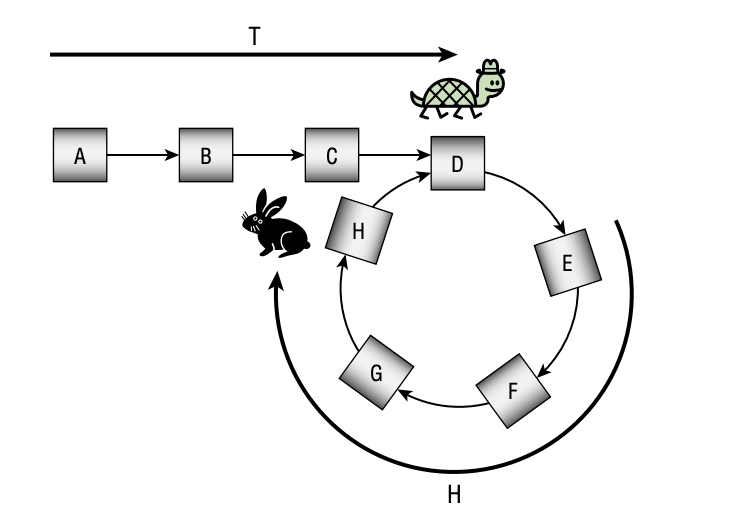

# 33. Linked List Cycle

## Solution 1. Memorized visited nodes

Time complexity : O(N)
全てのnodeを処理するため

Space complexity : O(N) worst case
ループの始まるに戻る時にプログラムは終了し、その時には全てのNodeはsetに保存されているため

## Solution 2. Floyd's Tortoise and Hare algorithm

Time complexity : O(N)

Space Complexity: O(1)

リストの始まりから異なる速度で移動する「亀」と「兎」と呼ばれる2つのオブジェクトをスタートさせます。亀は1ステップにつき1セルを移動します。兎は1ステップにつき2セルを移動します。
兎がnullのリンクに到達した場合、リストには終わりがあるので、ループはありません。
リストにループが含まれている場合、兎は最終的にループに入り、その中を周回し始めます。
その間、亀はゆっくりと進み、最終的にループに到達します。その時点で、亀と兎の両方がループの内部にいます。
ループに入る前に亀が移動するステップ数をT、Tステップ後の兎の位置からループの始まりまでの距離をH、ループ内のセル数をLとしましょう。

画像上では、T = 4、H = 4、L = 5となります。
兎は亀の2倍の速さで移動するため、Tセル移動してループに到達します。その後、画像に示された位置に到達するためにループ内でさらにTセルを横断します。これにより、以下の重要な事実＃1が導かれます。
事実＃1：ループ内のTセルを横断すると、開始位置からHセル離れた場所に到着します。

なお、LがTよりもはるかに小さい場合、兎はループを何周も走っているかもしれません。例えば、Tが102でLが5の場合、亀は102ステップ後にループに到達します。兎は51ステップ後にループに到達し、次の50ステップ（100セル）をループを20周して走り、その後ループ内でさらに1ステップ（2セル）移動します。この場合、H = 2です。
次の質問は、「兎はいつ亀を捕まえるのか？」です。亀がループに入ると、画像に示されるように、兎はHセル先にいます。亀と兎がループ内にいるので、兎を亀の後ろのL – Hセルと考えることもできます。兎は亀の1ステップにつき2セル移動するため、1ステップにつき1セルの速さで近づきます。つまり、兎はL – Hステップ後に亀を捕まえます。
画像上では、H = 4、L = 5なので、兎は5 – 4 = 1ステップ後に亀を捕まえ、両方の動物がセルEで出会います。
これは、衝突の時点で、亀がループ内でL – Hセル移動していることを意味します。2匹の動物が出会うとき、それらはループの始まりからL – (L – H) = Hセル不足しています。これが重要な事実＃2です。
事実＃2：兎が亀を捕まえるとき、2匹の動物はループの始まりからHセル不足しています。

もし衝突点から亀をHセル移動させることができれば、亀はループの始まりにいて、ループがどこから始まるかを知ることができます。残念ながら、Hの値がわからないので、亀をそこまで単純に移動させることはできません。
しかし、重要な事実＃1から、亀がループ内をTセル移動すると、開始位置からHセル先に到達することがわかっています。この場合、亀はループの始まりに到達します！
残念ながら、Tの値もわかっていないので、亀をそこまで単純に移動させることもできません。しかし、兎を連結リストの始まりに戻し、1回につき1セルだけ移動させるようにすれば、兎もTセルを横断した後にループの始まりに到達します。
つまり、2匹はTセルを横断した後に再び出会い、ループの始まりにいることになります